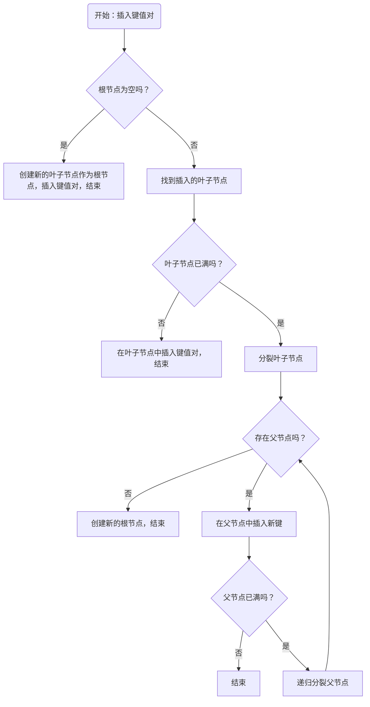
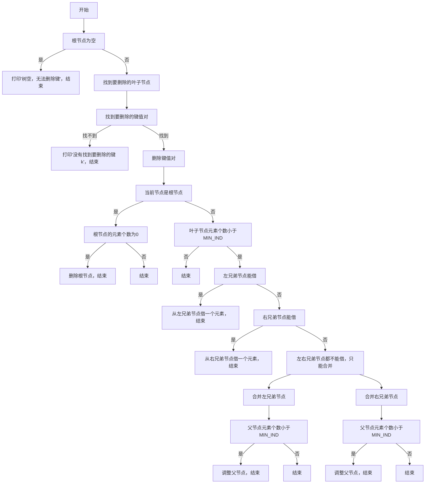
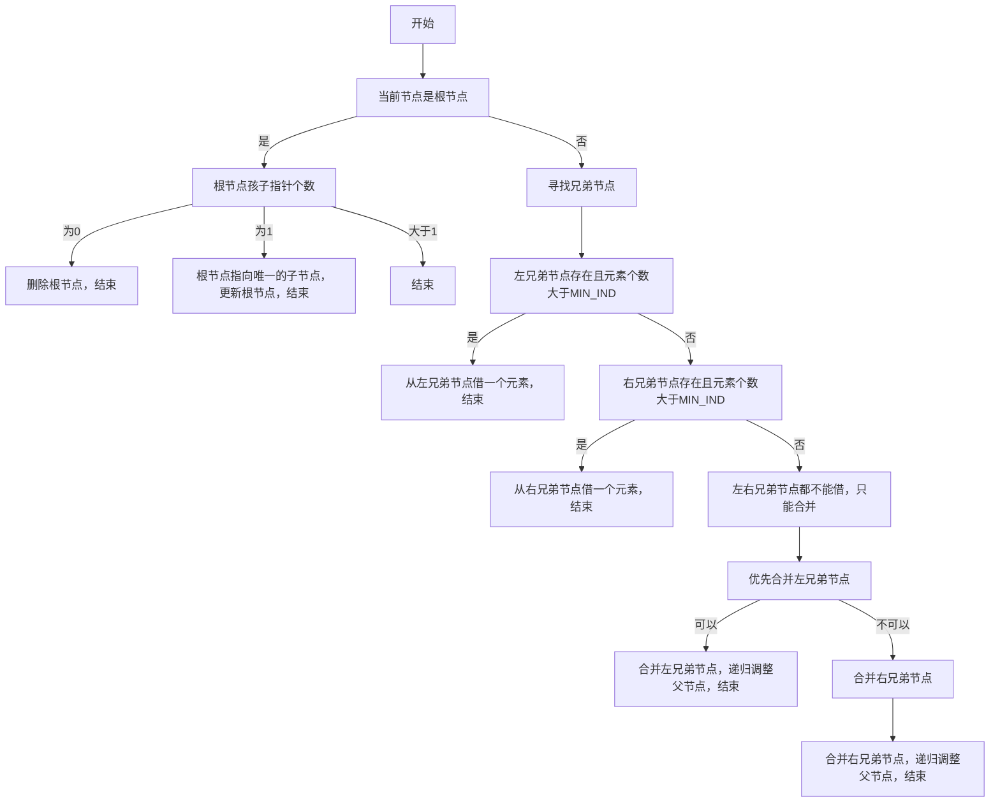
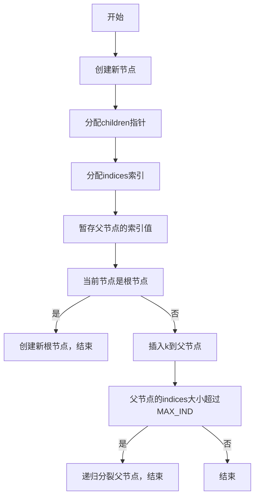

# A simple B+ tree implemented using C++
## 项目说明
- 个人项目开源地址：https://github.com/GeraldIAD/BPlusTree
- 参考文献：[解密B树与B+树：构建稳定可扩展的数据结构 - 知乎 (zhihu.com)](https://zhuanlan.zhihu.com/p/666310408)
- [在线B+树生成](https://www.cs.usfca.edu/~galles/visualization/BPlusTree.html)
- B+树的定义参考维基百科，“m阶B+树”最多有m-1个索引和m个儿子指针。
- 采用模板类，可以自定义键值对，演示时采用int类型key，string类型value。
## 数据结构
- indices类型为vector<Key>，保存的是键，也就是索引值。
- children类型为vector<Node*>，保存是指向孩子节点的指针。
- values类型为vector<Value>，尽在当前节点为叶子节点时（leaf==true）才有效，保存的是键对应的值。
## 函数设计
- 外部方法为insert插入键值对、remove删除键、search查找键。
- 内部方法split用于插入后父亲节点索引大于M-1时用于递归分裂父节点；adjust用于删除后父亲节点元素少于M/2时用于递归调整父节点。
## 逻辑介绍
使用mermaid绘制，[mermaid在线编辑器](https://mermaid.live/view#)
- insert

- remove

- adjust

- split

## 实验设计测试
```C++
int main() {
    BPlusTree<int, string> bpt;
    vector<int> keys1 = {1,2,3,4,5,6,7,8,9,10,11,12,13,14,15,16,17,18,19};
    vector<string> values1 = {"1", "2", "3", "4", "5", "6", "7", "8", "9","10","11","12","13","14","15","16","17","18","19"};
    vector<int> keys2 = {19,18,17,16,15,14,13,12,11,10,9,8,7,6,5,4,3,2,1};
    vector<string> values2 = {"19","18","17","16","15","14","13","12","11","10","9","8","7","6","5","4","3","2","1"};
    
    cout<<"测试从左向右插入和删除，以及查找键"<<endl;
    insertTest(bpt,keys1,values1);
    bpt.show();
    bpt.search(1);
    bpt.search(-1);
    removeTest(bpt,keys1);
    
    cout<<"测试从右向左插入和删除"<<endl;
    insertTest(bpt,keys1,values1);
    removeTest(bpt,keys1);

    cout<<"测试从左向右插入，从右向左删除"<<endl;
    insertTest(bpt,keys1,values1);
    removeTest(bpt,keys2);

    cout<<"测试从右向左插入，从左向右删除"<<endl;
    insertTest(bpt,keys2,values2);
    removeTest(bpt,keys1);
    return 0;
}
```

## 实验设计总结

我对于“m阶B树”和“m阶B+树”的理解是这样的：对于“m阶B树”，每个结点最多存储m个指向子节点的指针，m-1个键值对，这就是“m阶”的来源；而对于“m阶B+树”，实际上对于其索引节点，每个结点最多有m-1个键（不是键值对），而叶子节点最多也只有m-1个键值对，这里的“m阶”的体现并不是很直观，只是沿用了B树的称呼。这是一个关键的混淆点。网上说法不一 ，在实现时，根据维基百科，仍然取和B树相同的语义，即每个结点最多有“m”个指针，存储“m-1”个键。

我们在《数据结构》课程中已经学习了B树。B树产生的背景是，如果被检索的项存储在磁盘等外存储器上，每次查询都需要把其中一个块从磁盘读取到内存中之后才能进行。而读取的时间花费对于CPU来说是巨大的，因此需要一个数据结构能够在尽量少的读取次数中查找到结果。因此B树采用多叉的树形。

B+树是在B树的基础上，为了更好地提高磁盘I/O效率，得到更好的查询性能和空间利用率而提出的。B+树相比于B树，有几个不同：1. 非叶子节点（索引节点、内部节点）只保存索引信息，数据都保存在叶子节点。2. 所有相邻的叶子节点通过链表进行连接。 

由于B+树的索引节点上不存储数据，只存储键（B树的结点上存储的是键值对），此时一页中就可以存储更多的键，而树的阶数就能更大，也就是说，树形会更矮更胖，因此IO次数可以进一步减少，也就是说查询速率得到提升。
